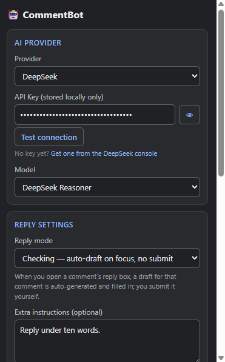

# CommentBot

CommentBot is a Chrome extension that helps you reply to comments with AI.
When you open the reply box under a comment, it figures out which comment you're replying to, asks the AI provider you configured, and drafts a short, context-aware reply in the commenter's language — then fills the box for you. Depending on the mode you pick, it either waits for you to send it or sends it automatically.

## Features

### AI Provider

Bring your own key and switch providers anytime — each keeps its own key & model (stored locally), with a **Test connection** check.

| Provider | Get a key | Models |
| --- | --- | --- |
| **Claude (Anthropic)** | [console.anthropic.com](https://console.anthropic.com/) | Haiku 4.5 · Sonnet 5 · Opus 4.8 |
| **DeepSeek** | [platform.deepseek.com](https://platform.deepseek.com/) | deepseek-chat · deepseek-reasoner |
| **ChatGPT (OpenAI)** | [platform.openai.com/api-keys](https://platform.openai.com/api-keys) | GPT-4o mini · GPT-4o · GPT-5.5 |
| **Gemini (Google)** | [aistudio.google.com/apikey](https://aistudio.google.com/apikey) | Gemini 2.5 Flash · Gemini 2.5 Pro |
| **Custom (OpenAI-compatible)** | your own endpoint | free-text model name |

### Reply settings

- **Focus-driven, one at a time** — drafts a reply for the exact comment whose reply box you opened.
- **Persona / extra instructions** — steer the tone, and the reply language, in one field.
- **Advanced** — write your own `system` / `user` prompt templates (with `{{variable}}` placeholders) to control *how* it replies.

**Reply modes** — pick how much it does for you:

| Mode | Behavior | Auto-submit |
| --- | --- | --- |
| **Manual** | Drafts only when you click **AI reply**. | No |
| **Checking** *(default)* | Auto-drafts and fills when you focus a reply box. | No |
| **Lazy** | Auto-drafts, fills, **and submits**. | Yes |
| **Crazy** | Scans the page and replies to comments one by one, **submitting** each. | Yes |

### Comment filter

Reply only to comments that match a **keyword** or **regex**; non-matching comments are skipped in every mode, and an invalid regex fails closed (replies to nothing).

### Settings

- **Enable per platform** — YouTube, X (Twitter), Facebook, and Threads, each toggled on/off.
- **Interface language** — English / 繁體中文.

## Installation

1. Open `chrome://extensions` and enable **Developer mode**.
2. Click **Load unpacked** and select this folder.
3. The extension icon appears in your toolbar.

## Usage

1. Click the extension icon, then set your **provider**, **API key** (hit **Test connection**), **model**, and **reply mode**.
2. Open a YouTube / X / Facebook / Threads post and click **Reply** on a comment.
3. Review the drafted reply and send it — or let Lazy/Crazy send it for you.

> Your API key is stored only in your browser (`chrome.storage.local`) and is used solely to call the
> provider's API directly. Calling an AI API incurs usage costs that vary by provider and model.

## Demo

<video src="assets/demo.mp4" controls muted width="720"></video>

> Video not playing on GitHub? [**Watch `assets/demo.mp4`**](assets/demo.mp4).

